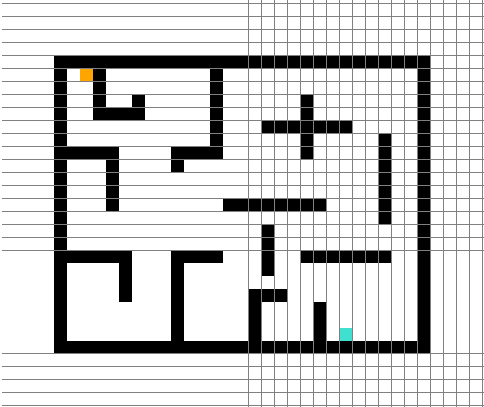
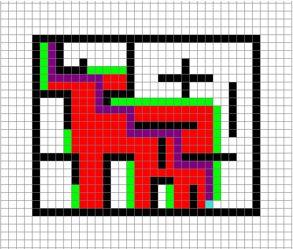

# A*-Visualisation-Python
A* Visualisation in Python using Pygame

**Controls**:
- **Right click** to add start, end and obstacles:
  - The first right click will create a start node (coloured orange)
  - The second left click will create an end node (coloured turquoise)
  - After that you can add obstacles (coloured black)
- **Space** will start the pathfinding, *you must have a start and end node*
- **'C'** will clear the grid
