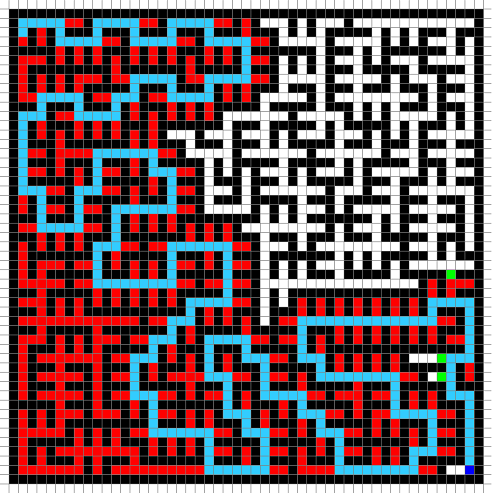

# A*-Maze-Visualisation-Python
A* Visualisation in Python for solving mazes using Pygame
The maze can be drawn using the mouse, or generated by a recursive backtracker algorithm.

 
 

**Controls**:
- **Left click** to add start, end and obstacles:
  - The first left click will create a start node (coloured orange)
  - The second left click will create an end node (coloured turquoise)
  - After that you can add obstacles (coloured black)
- **Right click** to remove obstacles and ndoes
- **Space** will start the pathfinding, *you must have a start and end node*
- **'C'** will clear the grid
- **'G'** will generate a new random maze

